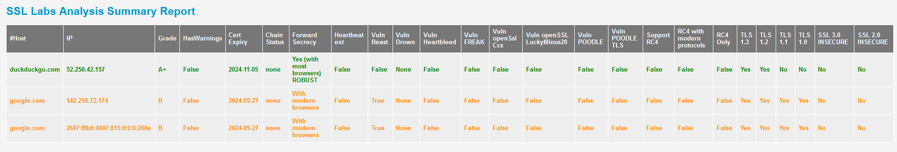

# SSL Labs Scan

[](https://github.com/kyhau/ssllabs-scan/actions/workflows/ci-workflow.yaml)
[](https://app.codecov.io/gh/kyhau/ssllabs-scan/tree/main)
[](https://github.com/kyhau/ssllabs-scan/actions/workflows/codeql-analysis.yml)
[](https://github.com/kyhau/ssllabs-scan/actions/workflows/secrets-scan.yml)
[](http://en.wikipedia.org/wiki/MIT_License)

This tool calls the SSL Labs [API v3](https://github.com/ssllabs/ssllabs-scan/blob/master/ssllabs-api-docs-v3.md) to do SSL testings on the given hosts, and generates csv and html reports.

All notable changes to this project will be documented in [CHANGELOG](./CHANGELOG.md).

---
## Built with
- Python - support Python 3.8, 3.9, 3.10, 3.11.
- [CodeQL](https://codeql.github.com) is [enabled](.github/workflows/codeql-analysis.yml) in this repository.
- [Dependabot](https://docs.github.com/en/code-security/dependabot/dependabot-version-updates) is [enabled](.github/dependabot.yml) for auto dependency updates.
- [Gitleaks](https://github.com/gitleaks/gitleaks) and [TruffleHog](https://github.com/trufflesecurity/trufflehog) are enabled in this GitHub Actions [workflow](.github/workflows/secrets-scan.yml) for secrets scanning.

---
## Input and outputs

Sample input: [sample/SampleServerList.txt](sample/SampleServerList.txt)

1. summary.html (sample output: [sample/summary.html](https://kyhau.github.io/ssllabs-scan/sample/summary.html))
1. summary.csv (sample output: [sample/summary.csv](sample/summary.csv))
1. _hostname_.json (sample output: [sample/google.com.json](sample/google.com.json))

**Sample html output:**


You can change the report template and styles in these files:
- [ssllabsscan/report_template.py](./ssllabsscan/report_template.py)
- [ssllabsscan/styles.css](./ssllabsscan/styles.css)

ℹ️ Please note that the SSL Labs Assessment API has access rate limits. You can find more details in the sections "Error Response Status Codes" and "Access Rate and Rate Limiting" in the official [SSL Labs API Documentation](https://github.com/ssllabs/ssllabs-scan/blob/master/ssllabs-api-docs-v3.md). Some common status codes are:
- 400 - invocation error (e.g., invalid parameters)
- 429 - client request rate too high or too many new assessments too fast
- 500 - internal error
- 503 - the service is not available (e.g., down for maintenance)
- 529 - the service is overloaded

---
## Build and run

### Linux
```
# Create and activate a new virtual env (optional)
virtualenv env
. env/bin/activate

# Install and run
pip install -e .
ssllabs-scan sample/SampleServerList.txt
```

### Windows
```
# Create and activate a new virtual env (optional)
virtualenv env
env\Scripts\activate

# Install and run
pip install -e .
ssllabs-scan sample\SampleServerList.txt
```

### Example console output
```
$ ssllabs-scan sample/SampleServerList.txt
Start analyzing duckduckgo.com...
Status: DNS, StatusMsg(Resolving domain names): waiting 30 secs until next check...
Status: IN_PROGRESS, StatusMsg(None): waiting 30 secs until next check...
Status: IN_PROGRESS, StatusMsg(None): waiting 30 secs until next check...
Start analyzing google.com...
Status: DNS, StatusMsg(Resolving domain names): waiting 30 secs until next check...
Status: IN_PROGRESS, StatusMsg(None): waiting 30 secs until next check...
Status: IN_PROGRESS, StatusMsg(None): waiting 30 secs until next check...
Status: IN_PROGRESS, StatusMsg(None): waiting 30 secs until next check...
Status: IN_PROGRESS, StatusMsg(None): waiting 30 secs until next check...
Status: IN_PROGRESS, StatusMsg(None): waiting 30 secs until next check...
Status: IN_PROGRESS, StatusMsg(None): waiting 30 secs until next check...
Creating summary.html ...
```

## Run Tox tests and build the wheels

```
pip install -r requirements-build.txt
tox -r
```
